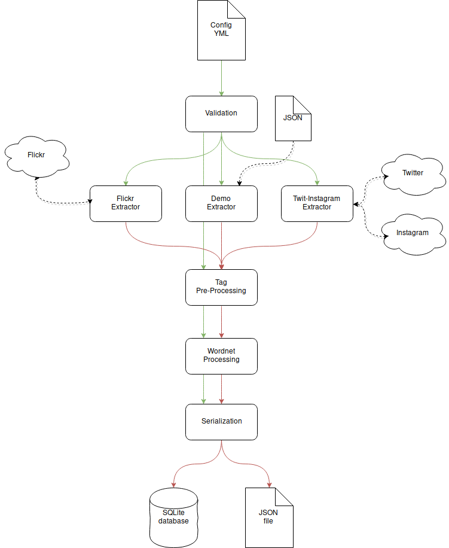

[![Build][travis-image]][travis-url]

# tag-extractor
Python *Flickr* and *Instagram* tag extractor (by location) using **Python 3**

## How to Run

Simply:
```bash
python3 setup.py develop
```
After setup please insteall
To install the nltk modules, run the following ```python3``` script:
```python
#! /usr/bin/python3
import nltk
nltk.download("omw")
nltk.download("brown")
```

Then:
```bash
tagextractor --config YOURCONFIG.yml
```

## Configuration

Example of configuration

```yaml
--- # Configuration
extraction:
  enabled: true
  api: instagram
  api_cfg:
    ACCESS_TOKEN : YOUR_TOKEN
    ACCESS_SECRET : YOUR_SECRET_KEY
    CONSUMER_KEY : CONSUMER_KEY
    CONSUMER_SECRET : CONSUMER_SECRET
    frequency: ../resources/frequs.json
  location:
    lat: 46.205850
    lon: 6.157521
    radius: 1
  number: 1000
  pipeline:
    Babel: false
    WordNet: true
  storage:
    module: DB
    module_cfg:
      path: sqlite:///database/output.db
classification:
  enabled: true
  inputdb: sqlite:///database/output.db
  ontology_path: resources
  ontology: kr-owlxml.owl
  outputdb: sqlite:///database/output-classified.db
```


## Architecture

### Extraction



### Classification

## References and Links

### Dependencies

The project uses multiple standard python libraries:
 - [nltk](http://www.nltk.org/howto/wordnet.html) (and the modules ```omw``` and ```brown```)
 - [unidecode](https://pypi.python.org/pypi/Unidecode)
 - [SQLAlchemy](http://docs.sqlalchemy.org/en/latest/)
 - [flickrapi](https://stuvel.eu/flickrapi-doc/)
 - [twitter](https://pypi.python.org/pypi/twitter)
 - [requests](http://docs.python-requests.org/en/master/)
 - [PyYAML](https://pypi.python.org/pypi/PyYAML)
 - [Owlready](https://pypi.python.org/pypi/Owlready)

### References
 - [A methodology for mapping Instagram hashtags](http://firstmonday.org/article/view/5563/4195)

### Links

 - [PyBabelfy](https://github.com/aghie/pybabelfy)
 - [python twitter examples](https://github.com/ideoforms/python-twitter-examples)
 - [Piplines in Python](https://brett.is/writing/about/generator-pipelines-in-python/)
 - [FlickrAPI bug fix](https://github.com/sybrenstuvel/flickrapi/issues/75)

[travis-image]:https://travis-ci.org/Mandarancio/tag-extractor.svg?branch=master
[travis-url]:https://travis-ci.org/Mandarancio/tag-extractor
